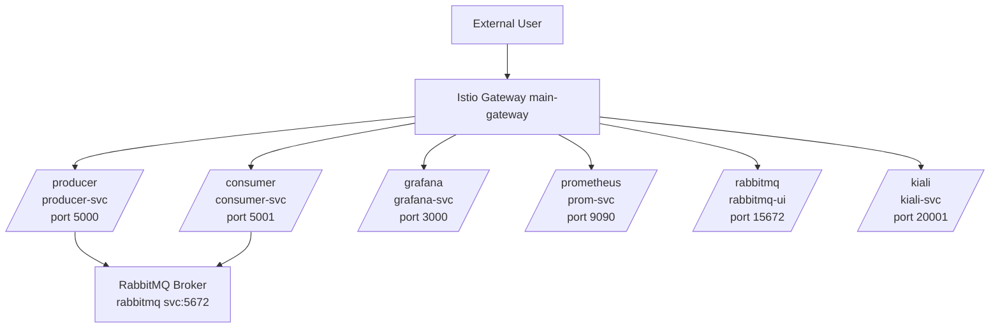

# Test Cluster Setup (Istio + RabbitMQ + Monitoring Stack)

## Overview

This repository contains a complete setup for a Kubernetes-based microservices architecture using [Kind](https://kind.sigs.k8s.io/), [Istio](https://istio.io/), and supporting services like RabbitMQ, Prometheus, Grafana, and Kiali. It includes:

- Producer and Consumer Flask services.
- RabbitMQ message queue.
- Istio ingress gateway and VirtualService routing.
- Monitoring with Prometheus and Grafana.
- Service mesh visualization with Kiali.

# Architecture
---




## Prerequisites

- A Linux system with sudo access.
- Internet access to pull Docker images and Helm charts.

---

## Bootstrap Setup

Run the bootstrap script to install Docker, Kind, kubectl, Helm, and deploy the cluster:

```bash
./bootstrap.sh
```

This script installs all dependencies and launches the full stack using Kind and Helm.

---

## Services Exposed (FQDN-based Routing)

| Service      | Namespace     | Path Prefix   | Destination FQDN                                             | Port  |
|--------------|---------------|----------------|---------------------------------------------------------------|-------|
| Producer     | `producer`    | `/producer`    | `producer-service.producer.svc.cluster.local`                 | 5000  |
| Consumer     | `consumer`    | `/consumer`    | `consumer-service.consumer.svc.cluster.local`                 | 5001  |
| Grafana      | `istio-system`| `/grafana`     | `monitoring-grafana.istio-system.svc.cluster.local`           | 3000  |
| Prometheus   | `istio-system`| `/prometheus`  | `monitoring-prometheus-server.istio-system.svc.cluster.local` | 9090  |
| RabbitMQ UI  | `rabbitmq`    | `/rabbitmq`    | `rabbitmq.rabbitmq.svc.cluster.local`                         | 15672 |
| Kiali        | `istio-system`| `/kiali`       | `kiali.istio-system.svc.cluster.local`                        | 20001 |

---

## Testing the Services

You can test sending and receiving messages through the producer and consumer like so:

```bash
# Send a message to the producer
curl -X POST http://localhost:31380/producer -H "Content-Type: application/json" -d '{"message": "Hello, Rabbit!"}'

# Fetch the message from the consumer
curl http://localhost:31380/consumer
```

---

## Accessing Services

Ensure the following Kind port forwarding is configured in `kind-cluster.yaml`:

```yaml
extraPortMappings:
  - containerPort: 80
    hostPort: 31380
    protocol: TCP
```

You can then access:

- Grafana: [http://localhost:31380/grafana](http://localhost:31380/grafana)
- Prometheus: [http://localhost:31380/prometheus](http://localhost:31380/prometheus)
- RabbitMQ UI: [http://localhost:31380/rabbitmq](http://localhost:31380/rabbitmq)  
  (Default login: **user**, password: **bitnami**)
- Kiali: [http://localhost:31380/kiali](http://localhost:31380/kiali)

---

## Notes

- You may need to wait a few moments after startup for all services to be fully ready.
- Restart your shell or run `newgrp docker` after bootstrapping to apply Docker group changes.

---
